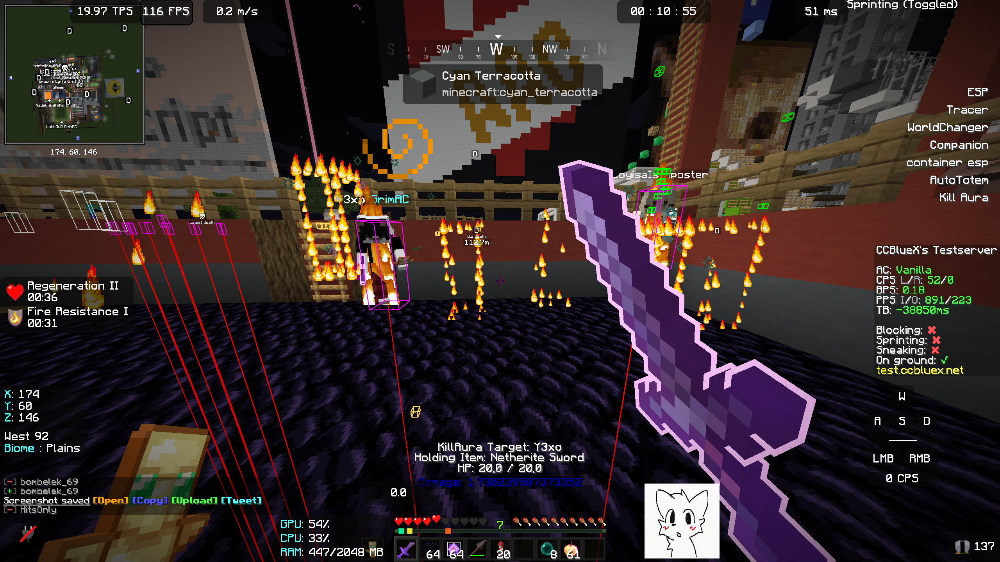
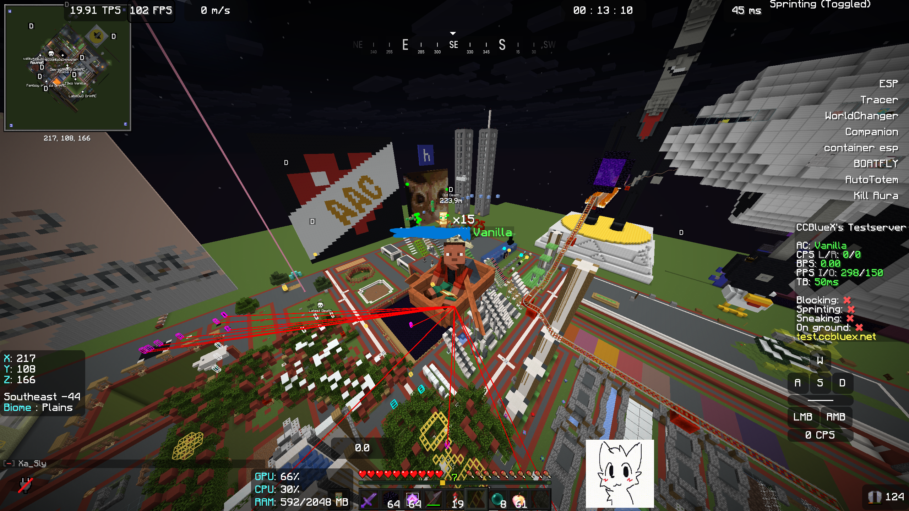
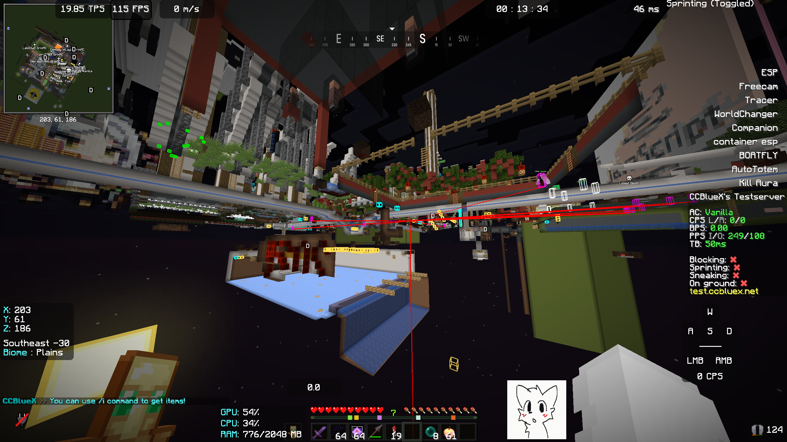

# Moonkitty
Most Minimal Minecraft Cheat Client

# [Moonkitty Homepage](https://sigmacat123.com/moonkitty/moonkitty.html)

# Works with FeatherClient and most Fabric clients/launchers

# Current Features:
  Esp (player, items and hostile mobs) 
  
  Container Esp
  
  WorldChanger
  
  Tracers (broken)
  
  Companion Gif
  
  TriggerBot
  
  Freecam / DebugCam
  
  Blink

  Boat-Fly

  AutoTotem

  KillAura

  Search

  Particle Aura

  HackList
  

# ScreenShots:
  
  
  screenshot with companion ON
  
  
  
  screenshot of KillAura being used

  
  
  screenshot of boatFly
  
  
  
  screenshot of Freecam

# Notes:

for issues with building from source with the remapping refer to the Fabric Docs 

press Insert to toggle menu (can be changed in Minecraft settings)

the default gif can be changed at:

*Your MC Folder*/moonkitty/1.gif

also make sure your Gif is not optmized
